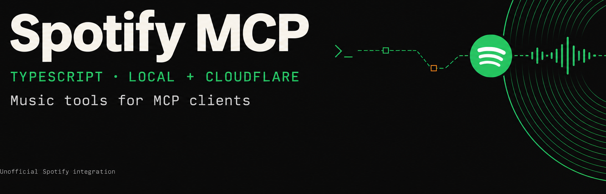

# spotify-mcp-cloudflare

**Beta.** A TypeScript [Model Context Protocol](https://modelcontextprotocol.io/)
server for Spotify search, playlists, library and playback. Run it locally over
stdio or remotely on Cloudflare Workers. Both modes share the same tools.
The [Python edition](https://github.com/jamiew/spotify-mcp) remains supported,
with a different set of tools, resources and prompts.

## Choose a mode

- **Native local stdio:** one account on your Mac or Linux machine. No Cloudflare
  deployment or Spotify client secret. Start with [local setup](#native-local-stdio).
- **Remote Worker:** browser-based OAuth, with separate Spotify authorization for
  each user. Use an invited instance or [deploy your own](#self-host-a-worker).

The invited instance is **`https://spotify-mcp-cloudflare.jamie-7e9.workers.dev/mcp`**
(Streamable HTTP; legacy SSE at `/sse`). It is not public enrollment: you need an
invitation and access through both the Worker and Spotify dashboard allowlists.
Its deployed revision can lag this branch. The checked-in `.mcp.json` uses this
restricted instance; replace its URL for your own deployment.

## Native local stdio

Requires **macOS or Linux, Node.js 22.18+**, and the pnpm version pinned in
`package.json`. From a checkout, run `pnpm install`.

Create an app in the [Spotify Developer Dashboard](https://developer.spotify.com/dashboard)
and register this exact redirect URI: **`http://127.0.0.1:8888/callback`**.
Use its public Client ID, not its client secret:

```sh
export SPOTIFY_CLIENT_ID=your_client_id
pnpm run login
# Open the printed authorization URL and approve in your browser.
pnpm --silent stdio
```

Use **`pnpm run login`**, not `pnpm login`, which signs in to the package registry.
Login uses PKCE with S256, random state and a timed, loopback-only callback.
Starting stdio never opens a browser or writes auth messages to stdout.

For an MCP client that launches subprocesses:

```json
{
  "mcpServers": {
    "spotify": {
      "command": "pnpm",
      "args": ["--dir", "/absolute/path/to/spotify-mcp-cloudflare", "--silent", "stdio"],
      "env": { "SPOTIFY_CLIENT_ID": "your_client_id" }
    }
  }
}
```

Tokens default to `~/.local/state/spotify-mcp`. Set `SPOTIFY_MCP_STATE_DIR` to an
absolute path to isolate another account. Tokens are **plaintext credentials**
protected by private directory/file permissions, not application-level encryption.
Writes are atomic and rotated refresh tokens persist.

Only one process may own a token directory. Disconnect your MCP client before
reauthorizing with `pnpm run login` or signing out with `pnpm signout`. Reauthorize
after scope changes; refreshing cannot add permissions. Signout deletes local
tokens, but revoke the app in Spotify's account settings to withdraw upstream
access too. After a crash, remove `owner.lock` only after confirming its owner is
gone. Never share token directories or expose stdio as a multi-user HTTP service.

## Self-host a Worker

You need Node.js 22.18+, the pinned pnpm version, a
[Cloudflare account](https://dash.cloudflare.com/sign-up) and a Spotify developer
app. From a checkout:

```sh
pnpm install
pnpm wrangler login
pnpm wrangler kv namespace create OAUTH_KV
```

In `wrangler.jsonc`, replace the checked-in `OAUTH_KV` namespace ID with yours.
Keep the `MCP_OBJECT` Durable Object binding to `SpotifyMCP` and its migration.
The OAuth provider uses KV for clients, grants and tokens.

Add your Worker's exact HTTPS redirect URI to the Spotify app:

```text
https://spotify-mcp-cloudflare.<your-subdomain>.workers.dev/callback
```

Wrangler reports your workers.dev subdomain on deployment. A custom domain's
`/callback` also works. Keep the Spotify client secret on the Worker:

```sh
pnpm wrangler secret put SPOTIFY_CLIENT_ID
pnpm wrangler secret put SPOTIFY_CLIENT_SECRET
pnpm wrangler secret put COOKIE_ENCRYPTION_KEY  # generate with: openssl rand -hex 32
pnpm wrangler secret put ALLOWED_EMAILS
pnpm run deploy
```

Set `ALLOWED_EMAILS` to a **nonempty**, comma-separated list of Spotify user/account
IDs or emails. Prefer stable IDs because some apps cannot read email. Empty or
unset allows any upstream-authorized account through this gate. Existing sessions
are checked before tool use. This is separate from Spotify's dashboard allowlist;
knowing the server URL is not access control.

### Connect remotely

Point an OAuth-capable MCP client at your Worker's `/mcp` URL. For a stdio-only
client that should use the hosted server, bridge it with
[`mcp-remote`](https://www.npmjs.com/package/mcp-remote):

```json
{
  "mcpServers": {
    "spotify": {
      "command": "npx",
      "args": ["mcp-remote", "https://spotify-mcp-cloudflare.<your-subdomain>.workers.dev/mcp"]
    }
  }
}
```

Approve the MCP client in your browser, then authorize your Spotify account.
Tokens refresh automatically. Reconnect and authorize again after scope changes.
Requested access covers playlist/library/follow reads and writes, cover upload,
playback, listening history and profile/email. There is no enforced read-only tier.

## Tools and prompts

34 tools. Track and playlist arguments accept bare IDs or `spotify:` URIs.
Results are compact structured objects; playback writes acknowledge the request,
not confirmed device state.

| Area | Tools |
| --- | --- |
| Profile and search | `get_me`, `search_music`, `get_tracks`, `get_artist`, `get_artist_albums`, `get_album` |
| Playlists | `list_playlists`, `get_playlist`, `create_playlist`, `update_playlist_details`, `set_playlist_cover`, `add_tracks_to_playlist`, `remove_tracks_from_playlist`, `reorder_playlist`, `follow_playlist`, `unfollow_playlist` |
| Library | `get_saved_tracks`, `save_tracks`, `remove_saved_tracks`, `get_saved_albums`, `save_albums`, `remove_saved_albums`, `check_library` |
| Following | `get_followed_artists`, `follow_artists`, `unfollow_artists` |
| Playback | `get_playback_state`, `control_playback`, `get_queue`, `add_to_queue`, `list_devices`, `transfer_playback` |
| History | `get_recently_played`, `get_top_items` |

Three prompt templates compose these tools; they do not restore restricted APIs
or grant permission to send Spotify content to a model:

| Prompt | Arguments | Purpose |
| --- | --- | --- |
| `discover_similar` | `artist` | Explore artist metadata and search, not an equivalent related-artists API |
| `taste_profile` | `time_range` | Summarize history with policy and inference limits |
| `build_playlist` | `vibe`, `size` | Draft from history, confirm, then create |

### Important behavior

- `get_playlist` returns one page by default. `fetch_all: true` enables bounded
  pagination; `max_items` defaults to 1,000 and caps at 10,000. Check
  `contents_status`, `complete`, `truncated` and `next_offset`: denied or partial
  contents do not mean an empty playlist.
- Playlist positions are zero-based. Unavailable/local tracks retain positions
  without an `id`. Read first, then pass the returned `snapshot_id` to
  `reorder_playlist` to guard against intervening edits.
- `search_music.offset` applies to each result type, from 0 through 1,000;
  `limit` is the total per type, not a page size. Search relevance is not an
  official artist top-track ranking.
- Playback control requires Spotify Premium and an active device.
  `set_playlist_cover` accepts an HTTPS JPEG URL and enforces Spotify's 256 KB
  encoded-payload cap.
- Tool annotations are client hints, not authorization or human approval.
  Playlist removal requests confirmation through elicitation when supported;
  decline, cancel or failure blocks removal. Otherwise use your client's own
  write-confirmation controls.

## Spotify access and policy

API availability depends on the app and account, not just this server. It adapts
between restricted and legacy endpoint shapes. Recommendations, audio features
and related artists are not exposed.

- [Quota rules](https://developer.spotify.com/documentation/web-api/concepts/quota-modes):
  Development Mode normally permits five dashboard-allowlisted users per app
  and requires a Premium owner. Larger existing allowlists may be grandfathered.
  Extended quota currently requires an organization, a launched service and at
  least 250,000 monthly active users, among other conditions.
- [July 2026 quota update](https://developer.spotify.com/blog/2026-07-23-web-api-quota-updates):
  up to 25 Client IDs, with Development Mode quota shared **per developer account**.
  `QUOTA_EXCEEDED` is returned without retries; there is no promised universal
  daily reset. Short `Retry-After` waits are honored; long waits return to the caller.
- [Access update](https://developer.spotify.com/blog/2026-02-06-update-on-developer-access-and-platform-security)
  and [migration guide](https://developer.spotify.com/documentation/web-api/tutorials/february-2026-migration-guide):
  restrictions for existing integrations were postponed, not universally applied.
  Restricted-mode playlist contents require ownership/collaboration; Extended
  Quota Mode is exempt from those endpoint changes.
- [Developer Policy](https://developer.spotify.com/policy), III.14, prohibits
  training **or otherwise ingesting Spotify Content into an AI/ML model**.
  III.13 restricts analysis/derived metrics; III.3 restricts voice assistants.
  “No training,” “metadata only,” self-hosting and Spotify's own integrations are
  not automatic permission. Resolve your intended data flow with Spotify before
  offering public AI access. This is a policy warning, not legal advice.

**This code alone does not authorize unrestricted public AI hosting.** Before
inviting others, explain scopes, provide privacy and deletion procedures, and
verify account isolation, refresh, reconnect and removal on the deployed revision.
Deleting a connector or changing an allowlist does not fully revoke upstream
access or clear Durable Object data. Encrypted OAuth grant properties do not
imply equivalent application-level encryption for Durable Object tokens.
See [PLAN.md](PLAN.md) for the remaining hosting/security work.

## Development

For local Worker development, copy `.dev.vars.example` to `.dev.vars`, fill in
its values, and run `pnpm dev`. Register `http://127.0.0.1:8788/callback` in Spotify;
`localhost` is not accepted. Wrangler simulates KV locally.

`pnpm check` runs the quality gates; `pnpm e2e` exercises deployed OAuth. Offline
tests use a fake Spotify upstream and do not prove live compatibility. The e2e
cache `.e2e-auth.json` and its private `.bak` files contain credentials.
Use `pnpm api:watch` to find unreviewed Spotify changes; use `--accept` only after
reading them. See [CLAUDE.md](CLAUDE.md) for contribution and live-verification
rules, and [CHANGELOG.md](CHANGELOG.md) for changes.

## Credits

[MIT license](LICENSE). The remote auth layer originated in
[lassejlv/spotify-mcp](https://github.com/lassejlv/spotify-mcp); tool/API design was
informed by [markandeyay/spotify-mcp](https://github.com/markandeyay/spotify-mcp).
Attribution is not permission to copy other projects: review their licenses first.
Banner created with [Glif](https://glif.app).
